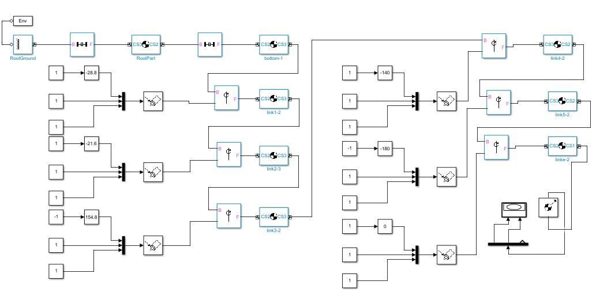
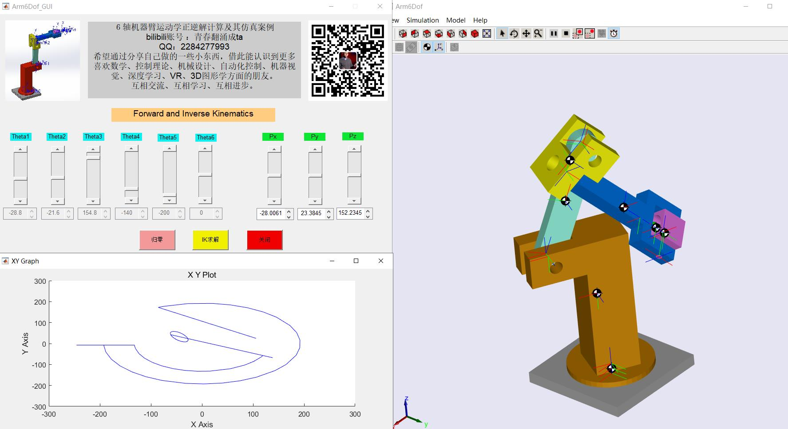

# Arm6Dof_Sim
This is the open source project of the 6DoF robot arm Simulation based on Matlab Simulink.

All CAD and code is licensed under GPL3: https://www.gnu.org/licenses/gpl-3.0.en.html

机器臂坐标系：

控制界面：

simulink模型：

仿真效果：

